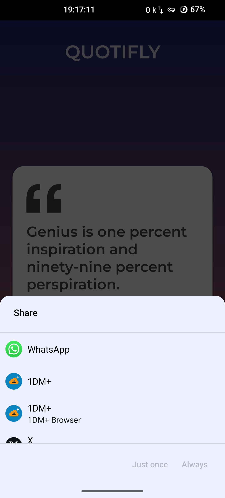

# Quotes App

## Overview
The Quotes App is a simple Android application that allows users to browse through a collection of quotes. 
Users can view random quotes, navigate through quotes sequentially, and share their favorite quotes with others.

## Features
- Display random quotes on the main screen.
- Navigate through quotes using previous and next buttons.
- Share quotes with friends via messaging apps or social media.
  
## Technologies Used
- Kotlin: The primary programming language used for Android app development.
- Jetpack Components: Utilizes Jetpack components such as ViewModel and LiveData for architecture.
- Gson: A library used to parse JSON data.
  
## Installation
1. Clone the repository to your local machine.
2. Open the project in Android Studio.
3. Build and run the app on an emulator or physical device.

## How to Use
1. Launch the app on your device.
2. Browse through quotes using the previous and next buttons.
3. Tap the share button to share your favorite quotes with others.

## Screenshots

## Contributing
Contributions are welcome! If you'd like to contribute to the Quotes App, please fork the repository and 
create a pull request with your changes.

## License
This project is licensed under the [MIT License](LICENSE).
